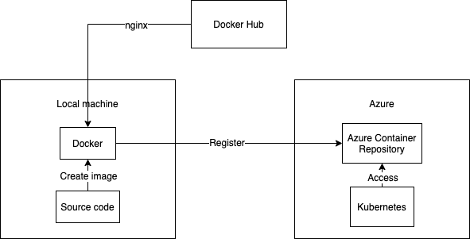
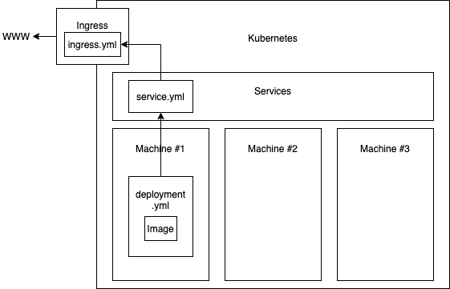

# MAD Itera - How to guide

## Prerequisite

1. Install Docker Desktop `$docker`
    - [Docker desktop for Mac](https://hub.docker.com/editions/community/docker-ce-desktop-mac) 
    - [Docker desktop for Windows](https://hub.docker.com/editions/community/docker-ce-desktop-windows)
2. Install Kubernetes Dashboard `$kubectl`
3. Install Azure Command Line `$az`

## How to register Docker image

### Create `dockerfile` and `.dockerignore`

1. Create a file named `Dockerfile` at root. A `Dockerfile` is a text document that contains all the commands a user could call on the command line to assemble an image. 
2. Create a `.dockerignore` file at root. This file should list all files that should be ignored. 

### Build your `Docker Image`

1. In your command line navigate to the root of the project (same location as your `Dockerfile` and `.dockerignore`). 
2. Build your docker image: 
    ```
    $docker build -t itetechmadacr.azurecr.io/<name of project> .
    ```
    `itetechmadacr.azurecr.io` is the name of MAD Itera Azure Container repository. If you do not include this name, then you will register your project to the default repository, `Docker Hub`.
3. Check that your images has successfully been created: `$docker images`. You should see the images you just created in the list. 

### Test your `Docker Image` locally *(optional)*

1. Run the following command to run your image:
    ```
    $docker run -p 8080:80 itetechmadacr.azurecr.io/<name of image>
    ```
    `-p 8080:80` allows us to map the port `8080` on our local dev machine to port `80` inside the container. `port 80` is the exposed port in our `Dockerfile`.
2. Go to `http://localhost:8080/`.

### Push your `Docker image` to `ACR` (Azure Container Repository)



1. In order for our `Kubernetes` to access our `Docker Image` we need to register our `Image` to `ACR`. 
2. Push/Register your `Docker Image` to `ACR` with following command:
    ```
    $docker push itetechmadacr.azureacr.io/<name of image>:latest
    ```
3. **OPS!** Sometimes your need to login to Azure in order to push to `itetechmadacr.azureacr.io`. Run `$az login` and login with Itera credentials. 

### Tell `Kubernetes` to access your `Docker Image`

1. Create a repository at root and call it `kubernetes`.
2. Create three files, `deployment.yml`, `service.yml`, and `ingress.yml`. Each file is going to be applied to the corresponding place, as shown in the image below.
3. `deployment.yml` holds the information about the name of the image you want and the port the container exposes. In addition it also specifies the name-space, i.e the location where it can be accessed. 
4. `service.yml` is the middle layer between the deployment and ingress. In this file you specify the target of the deployment and the port i can be accessed by the ingress. Likewise as the deployment, it also holds the namespace. 
5. `ingress.yml` is the one that exposes the container out to the world wide web. Ingress do not need namespace because the ingress is the only endpoint out of the "kubernetes world". 
6. To deploy your `.yml` files to kubernetes: (remember to change directory to `/kubernetes` directory)
    ```
    kubectl apply -f deployment.yml
    kubectl apply -f service.yml
    kubectl apply -f ingress.yml
    ```


 

## Deploy changes: 

There are two ways to do this: 

#### Latest
First, you can always use the latest version of your source code. This is easiest when you are in test stage and not depeding on different versions.
```
docker build -t itetechmadacr.azureacr.io/<name of image> .
docker push itetechmadacr.azureacr.io/<name of image>:latest
kubectl delete -f deployment.yml
kubectl apply -f deployment.yml
```
#### With versions
Second option is using versions. Then you need to update the version you want to run in `deployment.yml`. 
```
docker build -t itetechmadacr.azureacr.io/<name of image>:VER .
docker push itetechmadacr.azureacr.io/<name of image>:VER
//  Update version in deployment.yml
kubectl delete -f deployment.yml
kubectl apply -f deployment.yml
```

## Troubleshooting

#### Azure login failed? 
`$az account list` to check if you have an accout within azure.

#### What is my namespace?
`$kubectl get namespaces` to check what namespaces exists.

#### Create a new namespace
`$kubectl create namespace <namespace-name>` to create a new namespace.

## Sources
- https://github.com/Itera/avdelingstur_okt2019